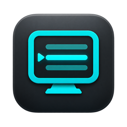

# Textream Personal

Kişisel macOS teleprompter sürümü. [Orijinal Textream](https://github.com/f/textream) üzerine kuruludur; konuşmayı takip eden **Word Tracking** özelliğini kullanır.

- Varsayılan görünüm taşınabilir bir penceredir. Üstteki **Move** alanından sürükleyin.
- Pencereyi kenarlarından veya sağ alt tutamaktan boyutlandırın. Eski 500 punto genişlik sınırı kaldırılmıştır.
- Üstteki **Aa / punto** düğmesinden yazıyı **14–200 punto** arasında, okuma sırasında da büyütün. Aynı kontrol Settings → Appearance içinde bulunur.
- Aynı düğmedeki **Line Spacing** kontrolü satır aralığını **1.0–2.5×** arasında açar. **1.0×** eski aralığı korur.
- Pencere konumu, boyutu, yazı tipi, punto, satır aralığı ve konuşma dili otomatik kaydedilir. Yeniden başlattığınızda korunur.
- İngilizce okuma için **Settings → Guidance → Speech Language → English (United States)** seçilebilir.
- Yanlış okuma veya kısa bir atlamadan sonra takip, yakındaki üç veya daha fazla net kelimeyi eşleştirerek yeniden yakalanır. Daha uzun bir gecikme için en az beş kelimelik belirgin bir ifade gerekir; sessizlikte ilerleme eklenmez.
- Ekran dışında kalan satırların konumu da hesaplanır; büyük puntoda veya bir ifadeyi atlayınca takip görünmeyen satıra ulaşabilir.

```bash
./script/build_and_run.sh
./script/test_preferences.sh
```

İlk komut uygulamayı yerel olarak derler ve `/Applications/Textream Personal.app` konumuna kurup açar. Uygulamalar klasöründeki Textream Personal simgesine çift tıklayarak da açabilirsiniz. Codex Run düğmesi aynı derleme komutunu kullanır. Uygulama kimliği `dev.osmanartuner.textream.personal` olduğundan ayarlar güncellemelerde korunur. Bu yerel sürüm App Store veya Developer ID dağıtımı değildir.

İşlem ve doğrulama kaydı: [DEVELOPMENT_NOTES.md](DEVELOPMENT_NOTES.md). Aşağıdaki bölüm orijinal projenin dokümantasyonudur; indirme bağlantıları orijinal Textream sürümüne gider.

---

<p align="center">
  
</p>

<h1 align="center">Textream</h1>

<p align="center">
  <strong>A free teleprompter for Mac, iPhone, and iPad.</strong>
</p>

<p align="center">
  Built for streamers, interviewers, presenters, and podcasters.
</p>

<p align="center">
  <a href="#download">Download</a> · <a href="#ios-26-companion">iPhone &amp; iPad</a> · <a href="#features">Features</a> · <a href="#how-it-works">How It Works</a> · <a href="#building-from-source">Build</a> · <a href="https://textream.net/privacy.html">Privacy</a>
</p>

<p align="center">
  
</p>

---

## What is Textream?

Textream is a free, open-source teleprompter that guides you through your script with three modes: **word tracking** (highlights each word as you say it), **classic** (constant-speed auto-scroll), and **voice-activated** (scrolls while you speak, pauses when you're silent). The Mac app displays your text in a sleek **Dynamic Island-style overlay**, a **draggable floating window**, or **fullscreen on a Sidecar iPad**. The iPhone and iPad app adds near-camera reading and presenter-only camera recording.

Paste your script, hit play, and start speaking. When you're done, the overlay closes automatically.

## Download

**[Download Textream from the App Store](https://apps.apple.com/app/textream/id6800061488)** for Mac, iPhone, and iPad.

Or **[download the latest .dmg from GitHub Releases](https://github.com/f/textream/releases/latest)**.

Or install with Homebrew:

```bash
brew install textream
```

> Requires **macOS 15 Sequoia** or later. Works on Apple Silicon and Intel.

## iOS 26 Companion

The Textream companion for iPhone and iPad is part of the same universal App Store listing as the Mac app.

- **Portrait and landscape** — A fullscreen teleprompter layout adapts to both orientations.
- **Mirror mode for teleprompter glass** — Read mode can flip the prompt horizontally, vertically, or on both axes whenever the device is in landscape. The prompt controls stay readable, and a compact ↔ button opens live mirror, position, text-size, speed, and playback-control settings.
- **Eye-contact reading position** — The active line sits just below the front camera by default, or can be centered in Prompter Settings.
- **The same three guidance modes** — Word Tracking, Classic auto-scroll, and Voice-Activated scrolling use the same behavior as the Mac app.
- **Optional camera while reading** — Read mode works as a distraction-free teleprompter, or you can show and hide the camera behind the prompt.
- **Selfie video recording** — Record mode captures camera video and microphone audio, starts with the front camera, and lets you switch between front and back cameras before recording.
- **Saved to Photos** — Completed recordings are added to Photos and appear in an adaptive Textream recordings gallery, where you can play, select, and delete them. If a save fails, Textream keeps a pending local copy and offers retry or discard controls in the current or next Record session.
- **Presenter-only prompt** — The translucent scrolling prompt is visible on screen while you record, but it is not burned into the saved video.
- **Matching fonts** — Sans, Serif, Mono, and OpenDyslexic are available on both platforms.
- **Liquid Glass** — Controls use the native iOS 26 Liquid Glass appearance.

## Features

### Guidance Modes

| Mode | Description | Microphone |
|---|---|---|
| **Word Tracking** (default) | macOS speech recognition highlights each word as you say it. Depending on your Mac, language, and system availability, recognition may happen on-device or Apple may process microphone audio. | Required |
| **Classic** | Auto-scrolls at a constant speed. No microphone needed. | Not needed |
| **Voice-Activated** | Scrolls while you speak, pauses when you're silent or muted. Perfect for natural pacing. | Required |

- **Scroll speed** — Adjustable 0.5–8 words/s for Classic and Voice-Activated modes.
- **Speech language** — Choose your preferred speech recognition language for Word Tracking mode.
- **Mouse scroll to catch up** — In Classic and Voice-Activated modes, scroll with your mouse to jump ahead or back. The timer pauses while you scroll and resumes from the new position.

### Overlay Modes

| Mode | Description |
|---|---|
| **Pinned to Notch** | A Dynamic Island–shaped overlay anchored below the MacBook notch. Sits above all apps. |
| **Floating Window** | A draggable window you can place anywhere on screen. Always on top. |
| **Fullscreen** | Fullscreen teleprompter on any display. Press **Esc** to stop. |

#### Pinned to Notch options

- **Follow Mouse** — The notch moves to whichever display your cursor is on.
- **Fixed Display** — Pin the notch to a specific screen.

#### Floating Window options

- **Follow Cursor** — The window follows your mouse cursor. A floating stop button lets you dismiss it.
- **Glass Effect** — Translucent frosted glass background with adjustable opacity (0–60%).

#### Fullscreen options

- **Display selection** — Choose which screen to show the fullscreen teleprompter on.
- **Esc to stop** — Press the Escape key to dismiss the fullscreen overlay.

### Size

- **Width** — Adjustable overlay width (280–500 px).
- **Height** — Adjustable text area height (100–400 px).

### Font & Color

| Setting | Options |
|---|---|
| **Font Family** | Sans, Serif, Mono, OpenDyslexic (dyslexia-friendly) |
| **Font Size** | XS (14 pt), SM (16 pt), LG (20 pt), XL (24 pt) |
| **Highlight Color** | White, Yellow, Green, Blue, Pink, Orange |

### External Display & Sidecar

| Mode | Description |
|---|---|
| **Off** | No external display output. |
| **Teleprompter** | Fullscreen teleprompter on the selected external display or Sidecar iPad. |
| **Mirror** | Flipped output for prompter mirror rigs. |

- **Mirror axis** — Horizontal (standard for mirrors), Vertical, or Both (180° rotation).
- **Target display** — Pick from connected external displays and Sidecar iPads.
- **Hide from screen share** — Hides the overlay from screen recordings and video calls.

### Remote Connection

View your teleprompter on **any device** — phone, tablet, or another computer — via a local network browser connection.

- **Enable in Settings → Remote** — Starts a lightweight HTTP + WebSocket server on your Mac.
- **QR code** — Scan the generated QR code from your phone or tablet to open the teleprompter instantly.
- **Real-time sync** — Words highlight, waveform animates, and progress updates in real time over WebSocket.
- **Mirror mode (per device)** — Tap **Mirror** in the remote view to flip the prompt horizontally for teleprompter glass. The choice is remembered on that device, and `?mirror=1` or `?mirror=0` in the URL presets it.
- **No app needed** — Works in any modern browser. No installation required on the remote device.
- **Configurable port** — Default port 7373, adjustable in advanced settings.
- **Direct local connection** — Textream does not relay Remote Connection traffic through a developer server. Enable it only on a local network and with devices you trust.

### Director Mode

Let someone else control your teleprompter remotely. A director can write, edit, and push scripts to your teleprompter in real time from any browser.

- **Enable in Settings → Director** — Starts a dedicated HTTP + WebSocket server (default port 7575).
- **Remote web UI** — The director opens a mobile-friendly web page with a full-featured script editor.
- **Live text editing** — The director types or pastes a script, hits Go, and your teleprompter starts immediately with word tracking.
- **Read-locked highlighting** — Already-read text is highlighted and locked in the web editor. Only unread text remains editable.
- **Real-time sync** — Word progress, waveform, mic status, and audio levels stream to the director's browser at 10 Hz.
- **Single-page mode** — Director mode works with a single page of text. Multi-page scripts are not used.
- **Editor disabled** — When director mode is active, the macOS editor is replaced with a QR code overlay so the director has full control.
- **QR code** — Scan or share the QR code from Settings or the editor overlay to connect the director instantly.

### File Support

- **PowerPoint notes import** — Drop a .pptx file to extract presenter notes as pages. For Keynote or Google Slides, export to PowerPoint first.
- **Save as .textream files** — Save your scripts as .textream files to reuse anytime. Keep your notes organized across presentations.
- **Multi-page support** — Navigate between pages with automatic advance. In follow-cursor mode, pages auto-advance with a 3-second countdown.

### Other

- **Live waveform** — Visual voice activity indicator so you always know the mic is picking you up.
- **Tap to jump** — Tap any word in the overlay to jump the tracker to that position.
- **Pause & resume** — Go off-script, take a break, come back. The tracker picks up where you left off.
- **Mute / unmute** — Toggle the microphone on or off from the overlay in any mode.
- **Private by design** — No accounts, ads, analytics, or Textream-operated cloud service. Scripts and settings stay under your control. In Word Tracking mode, macOS speech recognition may send microphone audio to Apple for processing; see the [privacy policy](https://textream.net/privacy.html).
- **Auto update checker** — Checks GitHub Releases for new versions on launch and from the Textream menu.
- **Open source** — MIT licensed. Contributions welcome.

## Who it's for

| Use case | How Textream helps |
|---|---|
| **Streamers** | Read sponsor segments, announcements, and talking points without looking away from the camera. |
| **Interviewers** | Keep your questions visible while maintaining natural eye contact with your guest. |
| **Presenters** | Deliver keynotes, demos, and talks with confidence. Never lose your place. |
| **Podcasters** | Follow show notes, ad reads, and topic outlines hands-free while recording. |

## How It Works

1. **Paste your script** — Drop your talking points, interview questions, or full script into the text editor.
2. **Hit play** — The Dynamic Island overlay slides down from the top of your screen.
3. **Start speaking** — Words highlight in real-time as you read. When you finish, the overlay closes automatically.

## Building from Source

### Requirements

For the macOS app:

- macOS 15+
- Xcode 16+

For the iOS companion:

- Xcode 26+
- The iOS 26 SDK and an installed iOS 26 Simulator runtime
- A physical iPhone or iPad to verify camera, microphone, recording, and Photos saving; Simulator can verify the interface and orientation layouts but does not provide camera recording hardware

The macOS target uses Swift 5 language mode. The new iOS target uses Swift 6 with complete concurrency checking.

### Build

```bash
git clone https://github.com/f/textream.git
cd textream/Textream
open Textream.xcodeproj
```

Choose the **Textream** scheme for macOS or **TextreamiOS** for iOS, select a compatible destination, then build and run with ⌘R in Xcode. The **TextreamiOS** scheme also includes the iOS unit tests.

### Install on an iPhone or iPad with Xcode

You can install and try the development build on your own device with [a personal Apple Account](https://developer.apple.com/documentation/xcode/running-your-app-on-simulated-or-physical-devices); a paid Apple Developer Program membership is not required for local testing.

1. Install Xcode 26 or later, clone this repository, and open `Textream/Textream.xcodeproj`.
2. In **Xcode → Settings → Accounts**, add your Apple Account.
3. Connect your unlocked iPhone or iPad to the Mac. Trust the computer if the device asks, then wait for it to appear in Xcode's run-destination menu.
4. Select the **Textream** project, select the **TextreamiOS** target, and open **Signing & Capabilities**.
5. Leave **Automatically manage signing** enabled and choose your personal team. If Xcode reports that `dev.fka.textream` is unavailable, change the bundle identifier to a unique value such as `com.yourname.textream.dev`.
6. Select the **TextreamiOS** scheme and your connected device in the Xcode toolbar, then press **⌘R** or choose **Product → Run**.
7. If prompted, enable [**Developer Mode**](https://developer.apple.com/documentation/xcode/enabling-developer-mode-on-a-device) on the device in **Settings → Privacy & Security → Developer Mode**, restart the device, confirm Developer Mode after restart, and run the app from Xcode again.
8. Accept the camera, microphone, speech-recognition, and Photos permissions only for the features you want to test.

This installs a development-signed build directly from your Mac; it does not publish anything to the App Store or TestFlight.

To try mirror mode, choose **Read**, enable **Mirror in landscape**, select an axis, and start the prompter. Rotate the device to landscape and use the small **↔** button at the top right to adjust mirror axis, reading position, text size, scroll speed, or hide the playback controls while the prompt is running.

Run the iOS test suite with **Product → Test** or **⌘U**. Camera capture, microphone input, recording, and Photos saving should be verified on a physical device because Simulator doesn't provide the same hardware behavior.

### Project structure

```
Textream/
├── Textream.xcodeproj
├── Info.plist
├── Textream/                         # macOS app
│   ├── TextreamApp.swift              # App entry point, deep link handling
│   ├── ContentView.swift              # Main text editor UI + About view
│   ├── TextreamService.swift          # Service layer, URL scheme handling
│   ├── SpeechRecognizer.swift         # macOS speech recognition integration
│   ├── NotchOverlayController.swift   # Dynamic Island + floating overlay
│   ├── ExternalDisplayController.swift # Sidecar / external display output
│   ├── NotchSettings.swift            # User preferences and presets
│   ├── SettingsView.swift             # Tabbed settings UI
│   ├── MarqueeTextView.swift          # Word flow layout and highlighting
│   ├── BrowserServer.swift            # Remote connection HTTP + WebSocket server
│   ├── DirectorServer.swift           # Director mode HTTP + WebSocket server
│   ├── PresentationNotesExtractor.swift # PPTX presenter notes extraction
│   ├── UpdateChecker.swift            # GitHub release update checker
│   └── Assets.xcassets/               # macOS app icon and colors
├── TextreamiOS-Info.plist             # iOS permissions and orientations
├── TextreamiOS/                       # iOS app, capture, speech, models, and views
│   └── Resources/                     # iOS assets and OpenDyslexic font
└── TextreamiOSTests/                  # iOS prompt and matching tests
```

## URL Scheme

Textream supports the `textream://` URL scheme for launching directly into the overlay:

```
textream://read?text=Hello%20world
```

It also registers as a macOS Service, so you can select text in any app and send it to Textream via the Services menu.

## Director Mode API

The Director Mode exposes an HTTP server and a WebSocket server on your local network. You can build your own director client using the protocol below.

### Ports

| Service | Default Port | Configurable in |
|---|---|---|
| **HTTP** (serves the built-in web UI) | `7575` | Settings → Director → Advanced (`1024`–`65534`) |
| **WebSocket** (bidirectional communication) | `7576` (HTTP port + 1) | Automatic |

### Connecting

1. Fetch the built-in Director page from `http://<mac-ip>:<http-port>` and extract the current 64-character `AUTH_TOKEN` embedded in its script. The token changes whenever the Director server restarts.
2. Open a WebSocket connection to `ws://<mac-ip>:<ws-port>` (e.g. `ws://192.168.1.42:7576`).
3. Within five seconds, send `{"type":"auth","text":"<token>"}` as the first WebSocket frame. The server closes clients that skip or fail authentication.
4. Send command frames to control the teleprompter. Once a script is active, the server broadcasts state frames as JSON at approximately 10 Hz.

Director Mode is intended for trusted local networks. HTTP and WebSocket traffic is not encrypted, so do not expose either port to the public internet or log/share the token.

### Commands (Client → App)

Send JSON messages over the WebSocket:

#### `auth` — Authenticate the connection

```json
{
  "type": "auth",
  "text": "<64-character token from the Director page>"
}
```

This must be the first frame on every connection. It does not start a read.

#### `setText` — Start reading a new script

```json
{
  "type": "setText",
  "text": "Welcome everyone to today's live stream..."
}
```

Replaces the current text, starts word tracking, and opens the teleprompter overlay. This is equivalent to pressing **Go** in the built-in web UI.

#### `updateText` — Edit unread text while active

```json
{
  "type": "updateText",
  "text": "Welcome everyone to today's live stream We changed the rest of the script...",
  "readCharCount": 42
}
```

Updates the full script text while preserving the confirmed read position. Set `readCharCount` to the latest `highlightedCharCount` received from Textream; do not calculate this offset independently. Textream clamps it to the Mac’s recognized count and the new script length. Keep the prefix before that offset unchanged and edit only unread text after it.

#### `stop` — Stop the teleprompter

```json
{
  "type": "stop"
}
```

Stops word tracking and dismisses the overlay.

### State (App → Client)

The server broadcasts a JSON object on every tick (~100 ms):

```json
{
  "words": ["Welcome", "everyone", "to", "today's", "live", "stream"],
  "highlightedCharCount": 24,
  "totalCharCount": 120,
  "isActive": true,
  "isDone": false,
  "isListening": true,
  "fontColor": "#F5F5F7",
  "cueColor": "#F5F5F7",
  "lastSpokenText": "Welcome everyone to today's",
  "audioLevels": [0.12, 0.34, 0.08, ...]
}
```

| Field | Type | Description |
|---|---|---|
| `words` | `string[]` | The script split into words (same order as displayed in the overlay). |
| `highlightedCharCount` | `int` | Number of characters recognized so far. Use this to determine the read boundary. |
| `totalCharCount` | `int` | Total character count of the full script. |
| `isActive` | `bool` | `true` when the teleprompter overlay is visible and a script is loaded. |
| `isDone` | `bool` | `true` when `highlightedCharCount >= totalCharCount` (finished reading). |
| `isListening` | `bool` | `true` when the microphone is actively listening. |
| `fontColor` | `string` | CSS color of the text in the overlay (user preference). |
| `cueColor` | `string` | CSS color of bracketed stage directions (user preference). |
| `lastSpokenText` | `string` | Last recognized speech fragment. |
| `audioLevels` | `double[]` | Array of audio level samples (0.0–1.0) for waveform visualization. |

When the overlay is not active, the server sends a frame with `isActive: false` and empty arrays.

### Example: Minimal Python Client

```python
import asyncio, json, re, urllib.request
import websockets

HOST = "192.168.1.42"
HTTP_PORT = 7575

def director_token():
    with urllib.request.urlopen(f"http://{HOST}:{HTTP_PORT}", timeout=3) as response:
        html = response.read().decode("utf-8")
    match = re.search(r"AUTH_TOKEN='([0-9a-f]{64})'", html)
    if not match:
        raise RuntimeError("Director token not found")
    return match.group(1)

async def director():
    async with websockets.connect(f"ws://{HOST}:{HTTP_PORT + 1}") as ws:
        # Authenticate before sending any commands.
        await ws.send(json.dumps({
            "type": "auth",
            "text": director_token()
        }))

        # Send a script
        await ws.send(json.dumps({
            "type": "setText",
            "text": "Hello everyone, welcome to the show."
        }))

        # Listen for state updates
        async for msg in ws:
            state = json.loads(msg)
            pct = 0
            if state["totalCharCount"] > 0:
                pct = state["highlightedCharCount"] / state["totalCharCount"] * 100
            print(f"Progress: {pct:.0f}%  Done: {state['isDone']}")
            if state["isDone"]:
                break

        # Stop
        await ws.send(json.dumps({"type": "stop"}))

asyncio.run(director())
```

## License

MIT

---

<p align="center">
  Original idea by <a href="https://x.com/semihdev">Semih Kışlar</a> — thanks to him!<br>
  Made by <a href="https://fka.dev">Fatih Kadir Akin</a><br>
  <a href="https://textream.net/privacy.html">Privacy</a> · <a href="https://textream.net/support.html">Support</a>
</p>
